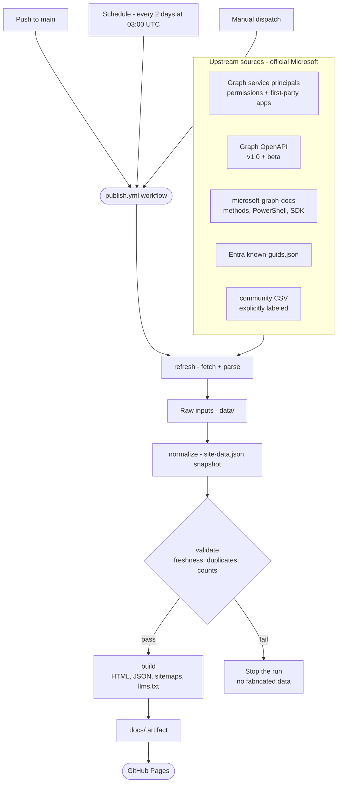

# Graph Permissions Explorer

Static Microsoft Graph permissions and Microsoft first-party application IDs reference, published with GitHub Pages.

Live site: https://permissions.cengizyilmaz.net/

## What this project does

This repository builds a fully static site that answers two main questions:

1. Which Microsoft Graph permissions exist, and what do they allow?
2. Which Microsoft first-party applications and App IDs should I recognize in Entra ID, audit logs, or sign-in logs?

The site stays on GitHub Pages for zero-cost hosting, but the public data is no longer meant to be maintained by manually committing stale snapshots. Production data is refreshed from upstream sources, normalized into one deterministic snapshot, validated, and only then turned into a Pages artifact.

## Current architecture

The build flow is:

1. Fetch raw upstream data from Microsoft Graph, Microsoft Learn, Entra Docs, and Microsoft Graph OpenAPI metadata.
2. Parse official permission methods, PowerShell commands, and SDK code examples from Microsoft Learn docs.
3. Normalize raw inputs into a single `site-data.json` snapshot.
4. Validate freshness, duplicate IDs, counts, and required sources.
5. Build static HTML, JSON contracts, sitemaps, and AI-discovery files.
6. Upload the generated `docs/` artifact to GitHub Pages.



Production hosting stays static, but production content is based on scheduled upstream refreshes instead of hand-maintained repo data.

## Repository layout

```text
Permissions/
|-- .github/                   Community health files, issue/PR templates, workflows
|   |-- workflows/             CI (lint/format/test) and production publish pipelines
|   |-- ISSUE_TEMPLATE/        Structured bug and feature request forms
|   `-- dependabot.yml         Automated dependency and action updates
|-- customdata/                Community-maintained application list
|-- data/                      Canonical raw inputs used by local normalize/build runs
|-- fixtures/raw/              Small fixture dataset for CI and tests
|-- scripts/
|   |-- node/                  Node.js refresh, normalize, validate, and build entry points
|   |   `-- lib/               Microsoft Learn parsing helpers
|   `-- powershell/            Graph/OpenAPI fetch and parse scripts
|-- src/
|   |-- config/                Validation thresholds and explicit resource/resource-relationship mapping
|   |-- lib/                   Normalization, rendering helpers, public data contracts
|   |-- templates/             HTML, CSS, JS, and static assets
|   |-- seo-optimizer.js       SEO/GEO metadata helpers
|   `-- sitemap-generator.js   Sitemap and robots generation
|-- test/                      Fixture-based tests
|-- docs/                      Generated output only
|-- .generated/                Local generated snapshots and validation summaries
|-- eslint.config.js           ESLint flat configuration
|-- .prettierrc.json           Prettier formatting rules
|-- .editorconfig              Editor defaults shared across the team
`-- .nvmrc                     Pinned Node.js version
```

## Source of truth vs local-only folders

These folders are important to distinguish:

- `src/` and `scripts/` are source code.
- `data/` is the canonical raw input location for local normalize/build commands.
- `fixtures/raw/` is the CI-safe fixture dataset and should stay in the repo for deterministic tests.
- `docs/` is generated output and should be treated as an artifact.
- `.generated/` is local working output for refreshed snapshots and validation summaries.

Inside `data/`, the build-critical files are:

- `GraphAppRoles.json`
- `GraphDelegateRoles.json`
- `MicrosoftApps.json`
- `GraphPermissionMethods.json`
- `GraphPermissionPowerShell.json`
- `GraphPermissionCodeExamples.json` or `GraphPermissionCodeExamples.part-*.json`
- `permission.csv`
- `GraphResourceSchemas.json`
- `GraphResourceDocumentation.json`

Only the files above are consumed by the normalize/build pipeline. Legacy CSV/debug exports were removed to keep the data directory deterministic.

## Commands

Install dependencies:

```bash
npm install
```

### Pipeline CLI

All pipeline steps are exposed through a single, self-documenting entry point:

```bash
node scripts/cli.js --help              # list commands
node scripts/cli.js <command> --help    # options for one command
```

Available commands: `refresh`, `refresh-docs`, `normalize`, `validate`, `build`.
Global flags: `--verbose` / `--quiet` control log verbosity (also via `LOG_LEVEL`).
The individual modules under `scripts/node/` remain runnable directly for backward
compatibility, and the `npm run` scripts below are thin wrappers over this CLI.

Refresh Microsoft Learn permission methods, PowerShell snippets, and official SDK code examples:

```bash
npm run refresh:methods
```

Refresh real upstream data and produce a normalized snapshot:

```bash
npm run refresh:data
```

Normalize an existing raw dataset without fetching again:

```bash
npm run normalize:data -- --raw-dir data --output .generated/local-real
```

Validate a normalized snapshot:

```bash
npm run validate:data -- --input .generated/local-real/site-data.json --summary .generated/local-real/validation-summary.json
```

Build the static site from a normalized snapshot:

```bash
npm run build:site -- --input .generated/local-real/site-data.json --output docs
```

Serve the generated site locally:

```bash
npm run serve
```

Run tests and a fixture-only build:

```bash
npm test
npm run build:fixture
```

## Code quality and tooling

The repository ships with an enterprise-grade quality toolchain:

- **ESLint** (flat config, `eslint.config.js`) for static analysis of Node and browser code.
- **Prettier** (`.prettierrc.json`) for deterministic formatting.
- **EditorConfig** (`.editorconfig`) for consistent editor defaults.
- **`.nvmrc`** pinning the supported Node.js version.
- **Dependabot** for weekly dependency and GitHub Actions updates.

Common commands:

```bash
npm run lint          # static analysis
npm run lint:fix      # auto-fix lint issues
npm run format        # apply Prettier formatting
npm run format:check  # verify formatting without writing
npm run check         # lint + format check + tests + fixture build
```

Run `npm run check` before opening a pull request. The CI workflow enforces the
same gates on every push and pull request.

## Data sources

The production dataset currently combines:

- Microsoft Graph service principals for permissions
- Microsoft Graph service principals for Microsoft first-party apps
- Microsoft Learn permission tables
- Microsoft Learn PowerShell snippets
- Microsoft Learn official SDK snippets for C#, JavaScript, Python, and PowerShell
- Entra Docs known GUID catalog
- Microsoft Graph OpenAPI method metadata (mined in Node by `scripts/node/lib/openapi-permissions.js`)
- Microsoft Graph OpenAPI schema metadata
- `customdata/OtherMicrosoftApps.csv` for explicitly labeled community entries

## Public outputs

The build writes both crawlable HTML and machine-readable JSON:

- `/index.html`
- `/permissions/{slug}.html`
- `/microsoft-apps.html`
- `/apps/{anchor}.html`
- `/build-info.json`
- `/data/catalog/permissions.json`
- `/data/catalog/apps-manifest.json`
- `/data/catalog/apps-*.json`
- `/data/permissions/{slug}.json`
- `/sitemap.xml`
- `/llms.txt`
- `/llms-full.txt`

## Apps catalog strategy

The apps catalog is no longer rendered as one giant HTML table.

Current behavior:

- `/microsoft-apps.html` is a lightweight overview and search/filter shell.
- The main table is hydrated from generated JSON chunks described by `apps-manifest.json`.
- Every app has its own crawlable detail page at `/apps/{anchor}.html`.
- Global site search points directly to app detail pages.
- The catalog stays fast on first paint without turning the app list into arbitrary numbered pages.

This keeps the overview page lightweight while moving SEO/GEO value onto stable, shareable app detail URLs.

## SEO and GEO outputs

The site now publishes stronger search and AI-discovery signals:

- Page-level canonical URLs
- Structured data for:
  - site-wide `WebSite`
  - homepage `CollectionPage` and `Dataset`
  - permission pages `TechArticle`
  - apps overview page `CollectionPage` and `Dataset`
  - app detail pages `ProfilePage` and `SoftwareApplication`
- `llms.txt` for concise AI discovery
- `llms-full.txt` for extended AI discovery with permission URLs and app detail URLs
- XML sitemaps for homepage, permissions, apps overview, and app detail pages
- `build-info.json` for freshness, snapshot ID, and source metadata

## GitHub Actions

### `ci.yml`

Runs on pull requests and pushes.

- installs dependencies
- runs ESLint (`npm run lint`)
- checks Prettier formatting (`npm run format:check`)
- runs tests
- builds the fixture site
- audits production dependencies (non-blocking)

### `publish.yml`

Runs on pushes to `main`, on a schedule every 2 days at 03:00 UTC (`cron: "0 3 */2 * *"`), and on manual dispatch.

- refreshes upstream data
- validates the normalized snapshot
- publishes the validation summary into the workflow summary
- builds the static site
- uploads the Pages artifact
- deploys to GitHub Pages

The production workflow uses artifact deploy. It does not commit generated `docs/` back into the repository.

## Local refresh prerequisites

For `npm run refresh:data`, you need:

- Node.js 22+
- PowerShell (`pwsh` or Windows PowerShell)
- Azure CLI logged in
- permission to obtain a Microsoft Graph access token
- Microsoft Graph PowerShell modules available

The workflows install the PowerShell modules automatically. Local runs expect the same tools to be available on your machine.

## Validation philosophy

The pipeline is intentionally fail-fast on required sources.

Important behavior:

- synthetic permission fallback is removed
- required sources must exist
- duplicate App IDs fail validation
- stale required sources fail validation in production mode
- missing official methods/code examples/schema data is reported as warnings, not fabricated data

## Notes on unused or retired paths

The following legacy behaviors are no longer part of the active production flow:

- runtime permission-tab fetching in the browser
- full all-apps sidebar generation
- giant single-page apps HTML dump
- `search-index.js` as a committed/generated JavaScript bundle

The following local paths can still exist for debugging, but are not production inputs:

- `docs/*`
- `.generated/*`

## Local development examples

Refresh official Learn parsing only:

```bash
npm run refresh:methods
```

Normalize existing raw files from `data/`:

```bash
node scripts/node/normalize-data.js --raw-dir data --output .generated/local-real
```

Validate them:

```bash
node scripts/node/validate-data.js --input .generated/local-real/site-data.json --summary .generated/local-real/validation-summary.json
```

Build the local static site:

```bash
node scripts/node/build-site.js --input .generated/local-real/site-data.json --output docs
```

Serve and inspect:

```bash
npx http-server docs -p 8080 -o
```

## Credits

- Inspired by https://github.com/merill/graph-permissions-explorer
- Built and maintained by https://cengizyilmaz.net/

## License

MIT
